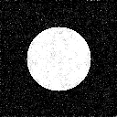
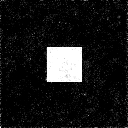
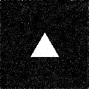
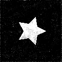

# Black-and-White Shapes Diffusion

This repo contains a **simple, educational example** of a diffusion model in **PyTorch** that learns to generate **single-channel black-and-white images** of basic shapes (circle, triangle, square, star). It’s designed to be straightforward, letting you see how diffusion works **without having to install a million dependencies** in a wild conda environment. Additionally, it will absolutely overfit to the 4 shapes in its current form, but feel free to add more! Or edit it to use a clip tokenizer, pull from a larger labeled DB—have fun!

---

## Table of Contents
- [Overview](#overview)
- [How It Works](#how-it-works)
- [Scripts Breakdown](#scripts-breakdown)
- [Installation](#installation)
- [Training](#training)
- [Inference](#inference)
- [Sample Outputs](#sample-outputs)
- [License](#license)

---

## Overview

You’ll find two main Python scripts:

1. **Training Script** (`train_diffusion.py`)  
   Generates a synthetic dataset of black-and-white shapes, then trains a **U-Net**-based diffusion model from scratch.

2. **Inference Script** (`inference.py`)  
   Loads the trained model to **sample** new shapes by running the **reverse diffusion** process.

This project is purely for learning and playing around. It doesn’t do fancy color images or big-scale data, but it’s a neat way to grasp the *core concepts* of diffusion.

---

## How It Works

1. **Data Generation**  
   - We create synthetic images of a single shape in white (`255`) on a black (`0`) background, all of the same size and orientation.  
   - Shapes include **circle**, **triangle**, **square**, and **star**.  
   - Each is centered in a 128×128 frame, with no random scaling or rotation.

2. **Forward Diffusion**  
   - A linear schedule gradually adds noise to the clean images.  
   - In step `t`, we combine a fraction of the original image and a fraction of pure noise, controlling how noisy it gets over time.

3. **U-Net Architecture**  
   - Our U-Net includes:
     - **Down blocks** that compress the spatial dimensions,
     - **Up blocks** that expand them back,
     - **Residual blocks** with skip connections,
     - **Conditioning** on shape ID & time step (via an embedding).  
   - The model is trained to predict the noise added at time `t`.

4. **Reverse Diffusion** (Sampling)  
   - We start from pure noise and iteratively *denoise* step-by-step, conditioning on the shape ID.  
   - After enough steps, we end up with a generated shape image.

---

## Scripts Breakdown

### 1) `train_diffusion.py`

- **Data Generation**: Creates `num_samples` synthetic images (default: 5,000).  
- **Splitting**: Splits the dataset into training and validation sets.  
- **Model**: Builds the U-Net (`AdvancedBWUNet`) with shape/time embeddings.  
- **Diffusion**: Uses a linear alpha schedule for noise addition, and trains the model to predict noise.  
- **Training**: Runs for the specified epochs (default: 500).  
- **Checkpoints**: Saves the best model as `advanced_bw_unet_best.pth` and a final model as `advanced_bw_unet_final.pth`.

### 2) `inference.py`

- **Arguments**:
  - `--model`: Path to the trained `.pth` file (e.g., `advanced_bw_unet_best.pth`)
  - `--shape`: Which shape to generate (`circle`, `triangle`, `square`, `star`)
  - `--steps`: How many diffusion steps to run in reverse (default 1000)
  - `--out`: Output filename (default: `bw_inferred.png`)
  - `--device`: `cpu` or `cuda` (default `cuda`)
  - `--image_size`: Size of the generated image (default 128)
- **Loads the model** and **reverse-diffuses** from noise until a shape emerges.  
- **Saves** the generated image to your chosen file name.

---

## Installation

**1) Clone the repo**
```bash
git clone https://github.com/Esemianczuk/Simple_Diffusion.git
cd imple_Diffusion
```

**2) Install dependencies**  
If you want to install everything via pip, you can do:
```bash
pip install torch>=1.9 opencv-python numpy
```

**3) (Optional) GPU Support**  
- If you need a specific CUDA version of PyTorch, visit [the official PyTorch site](https://pytorch.org/) and follow the installation commands for your environment.

---

## Training

To train the diffusion model from scratch, simply run:
```bash
python train_diffusion.py
```
**What happens:**
1. A folder named `synthetic_shapes_bw` is created with synthetic shapes and a `labels.txt`.
2. A U-Net is trained for 500 epochs by default.
3. The “best” checkpoint (lowest validation loss) is saved as `advanced_bw_unet_best.pth`.
4. A final checkpoint is saved as `advanced_bw_unet_final.pth`.

Feel free to tweak hyperparameters like `epochs`, `batch_size`, `lr`, etc. in the script’s function call.

---

## Inference

After training, you can generate brand-new shapes via reverse diffusion:

```bash
python inference.py \
    --model advanced_bw_unet_best.pth \
    --shape square \
    --steps 1000 \
    --out bw_inferred.png \
    --device cuda \
    --image_size 128
```

- `--model`: Path to your trained checkpoint (e.g., `advanced_bw_unet_best.pth`).
- `--shape`: One of `circle`, `triangle`, `square`, or `star`.
- `--steps`: The total number of reverse diffusion steps. More steps can yield a slightly cleaner result but takes longer.
- `--out`: Output image filename (default: `bw_inferred.png`).
- `--device`: Run on `cpu` or `cuda`.
- `--image_size`: The resolution of the output (must match what the model expects, typically 128).

When it finishes, you’ll see `bw_inferred.png` in your folder, containing a newly generated B/W shape!

---

## Sample Outputs

Below are some samples generated by the model. All outputs are single-channel images (scaled between 0 and 1, saved as PNGs with black/white pixels):

| Circle                                   | Square                                    |
|:----------------------------------------:|:-----------------------------------------:|
| |  |

| Triangle                                    | Star                                    |
|:-------------------------------------------:|:----------------------------------------:|
| |    |

---

## License

This project is open-sourced under the [MIT License](LICENSE). Feel free to use it to learn, modify it, and share it. Enjoy experimenting with diffusion!
```
